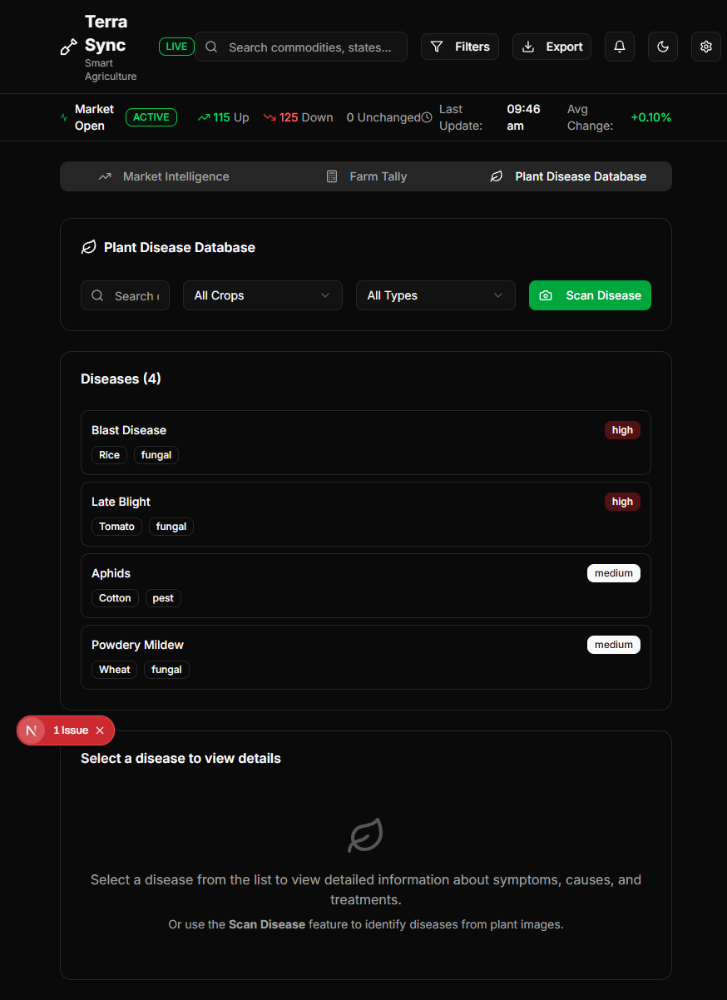
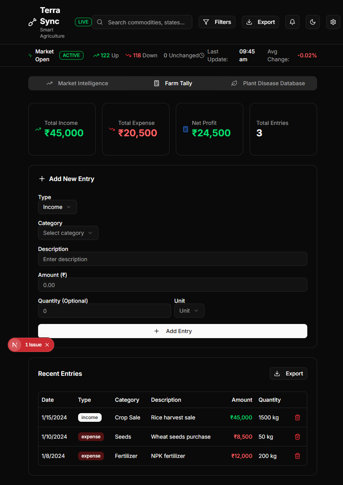
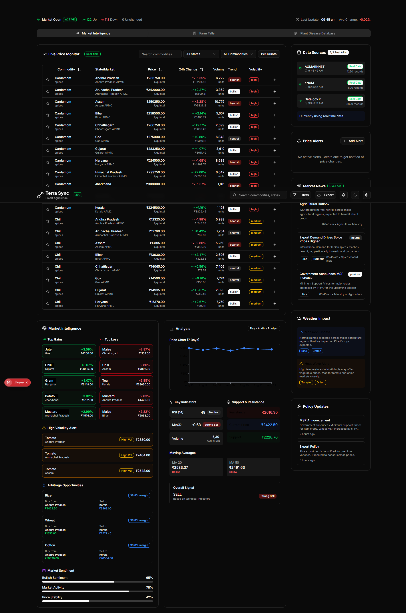

<p align="center">
  
</p>

<h1 align="center">🌱 TerraSync</h1>

<p align="center"><em>Real-time agricultural market intelligence — powered by Terra Engine</em></p>

<p align="center">
  
  
  
  
  
  
  
</p>

---

## 🌟 Overview  

TerraSync is a **next-gen agricultural dashboard** for farmers, traders, and researchers.  
It consolidates **real-time commodity prices, farm management, plant health, and policy updates** into a **sleek, intuitive interface**.  

> ⚠️ **Alpha Release** – Frontend is open-source; backend (Terra Engine) is closed alpha. All data is **mock/dummy**.  

---

## 🎯 Features  

<p align="center">
  
  
  
</p>

- 📈 **Live Price Monitoring** – Dynamic commodity prices  
- 📊 **Market Intelligence** – Top gainers, losers, and key indicators  
- 🌦️ **Weather Impact Analysis** – Forecast effects on crop yield & market prices  
- 🦠 **Plant Disease Database** – Identify and manage plant health  
- 💰 **Farm Tally** – Track income and expenses  
- 📰 **Policy Updates** – Alerts on MSP & export changes  
- ⚡ **Volatility Alerts** – Notifications for high price fluctuations  
- 📉 **7-Day Trend Charts** – Interactive, visual insights  

---

## 🛠️ Tech Stack  

**Frontend (Open Source)**<br>
[](https://nextjs.org) <br>
[](https://vercel.com) <br>
[](https://v0.dev) <br>
[](https://ui.shadcn.com) <br>
- React + TailwindCSS  

**Backend — Terra Engine (Closed Alpha)**<br>  
- Mock APIs for frontend in this alpha  

---

## ⚡ Quick Start  

```bash
# Clone the repo
git clone https://github.com/your-username/terrasync.git
cd terrasync

# Install dependencies
npm install

# Run locally
npm run dev
```

Open [http://localhost:3000](http://localhost:3000)  

> ⚠️ All charts and alerts currently use **mock data**.  

---

## 🤝 Contributing  

TerraSync is **community-first**. You can help by:  

- Enhancing **UI/UX** (Tailwind + shadcn/ui)  
- Adding **charts, dashboards, and visualizations**  
- Integrating **frontend with Terra Engine APIs** in the future  
- Fixing bugs & improving performance  

📌 Fork → Branch → Pull Request  

---

## 📜 License  

- **Frontend:** MIT License  
- **Backend / Terra Engine:** Closed Alpha  

---

## 📬 Contact  

💡 Feedback, ideas, or collaboration?  
📧 your-email@example.com  

---

✨ *TerraSync + Terra Engine is a community-driven platform for agricultural insights — actionable, beautiful, and modern.*  

---
